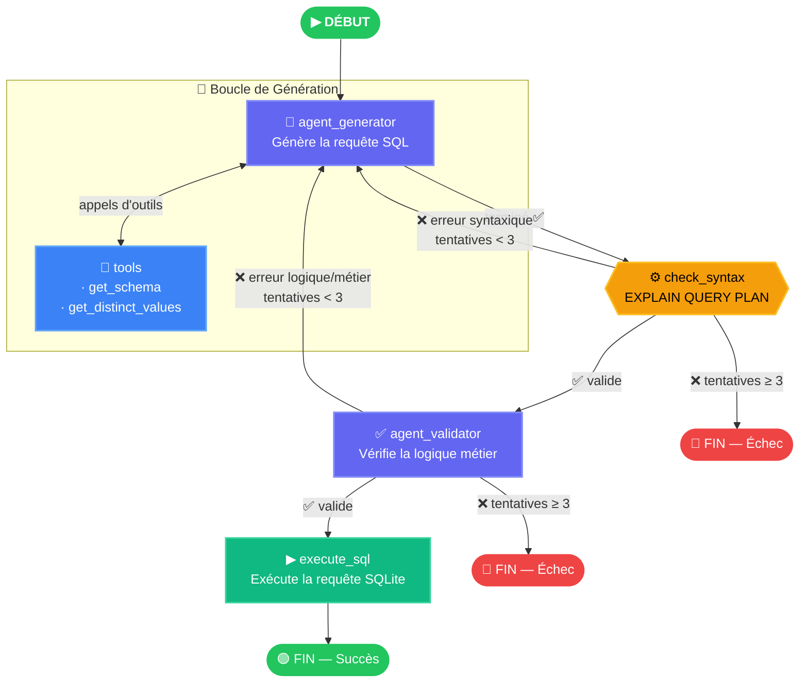
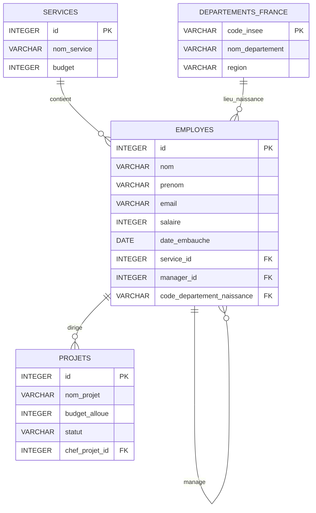

# TextToSQL — Agent IA de Langage Naturel vers SQL

> Transforme des questions en langage naturel en requêtes SQL validées et sécurisées grâce à un pipeline multi-agents LangGraph.

---

## Présentation

**TextToSQL** est une application agentique qui prend une question utilisateur en langage naturel et génère, valide, puis exécute automatiquement la requête SQL correspondante sur une base de données SQLite.

Le pipeline est construit avec **LangGraph** et orchestre deux agents LLM spécialisés (générateur et validateur) connectés au sein d'un graphe à état, avec une logique de réessai automatique, une vérification syntaxique et des sorties structurées.

---

## Fonctionnalités

- **Agent Générateur** — Génère une requête SQL `SELECT` à partir d'une question en langage naturel, en utilisant des outils pour inspecter le schéma et les valeurs réelles de la base.
- **Vérification Syntaxique** — Valide la requête syntaxiquement via `EXPLAIN QUERY PLAN` de SQLite, avant toute évaluation par un agent.
- **Agent Validateur** — Un second agent LLM qui vérifie la *logique métier* de la requête : jointures correctes, filtres appropriés, fidélité à l'intention de l'utilisateur.
- **Boucle d'auto-correction** — Si la requête est syntaxiquement incorrecte ou logiquement erronée, le graphe la régénère automatiquement (jusqu'à 3 tentatives).
- **Garde de Sécurité** — Les instructions `DELETE`, `DROP`, `UPDATE` et `INSERT` sont bloquées avant toute exécution.
- **Sorties Structurées** — Les deux agents utilisent des modèles Pydantic pour garantir des réponses typées et validées par schéma.

---

## Schéma du Graphe



---

## Stack Technique

| Bibliothèque | Utilisation |
|---|---|
| [LangGraph](https://github.com/langchain-ai/langgraph) | Orchestration du graphe multi-agents avec état |
| [LangChain](https://github.com/langchain-ai/langchain) | Création des agents, binding des outils, templates de prompts |
| [Google Gemini](https://ai.google.dev/) (`gemini-3.1-flash-lite`) | LLM sous-jacent pour les deux agents |
| [Pydantic](https://docs.pydantic.dev/) | Validation des sorties structurées |
| [SQLite](https://www.sqlite.org/) | Base de données relationnelle locale |
| [python-dotenv](https://pypi.org/project/python-dotenv/) | Gestion des variables d'environnement |

---

## Installation

### 1. Cloner le dépôt

```bash
git clone https://github.com/your-username/TextToSQL.git
cd TextToSQL
```

### 2. Installer les dépendances

```bash
pip install -r requirements.txt
```

### 3. Configurer la clé API

Créez un fichier `.env` à la racine du projet :

```env
GOOGLE_API_KEY=votre_clé_api_google_ici
```

> Obtenez une clé API gratuite sur [aistudio.google.com](https://aistudio.google.com/).

### 4. Lancer l'application

```bash
python main.py
```

---

## Exemple d'utilisation

**Entrée :**
```
Donne moi la liste des personnes qui travaillent dans la tech
```

**Trace d'exécution :**
```
Agent Générateur
  → Utilisation du tool 'get_schema'
  → Utilisation du tool 'get_distinct_values'
Vérification syntaxique
Agent Validateur
  → Utilisation du tool 'get_schema'
  → Utilisation du tool 'get_distinct_values'
Exécution requête
```

**Résultat :**
```sql
SELECT e.nom, e.prenom
FROM employes e
JOIN services s ON e.service_id = s.id
WHERE s.nom_service = 'Tech & Data';
```
```
Résultats : [('Lovelace', 'Ada'), ('Turing', 'Alan'), ('Hamilton', 'Margaret')]
```

---

## Schéma de la Base de Données

