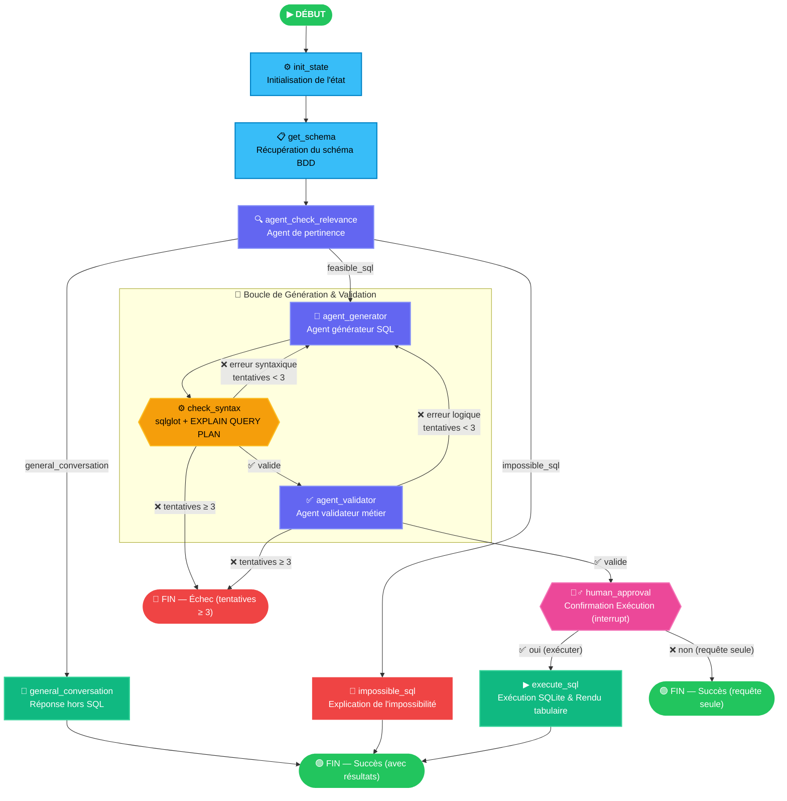
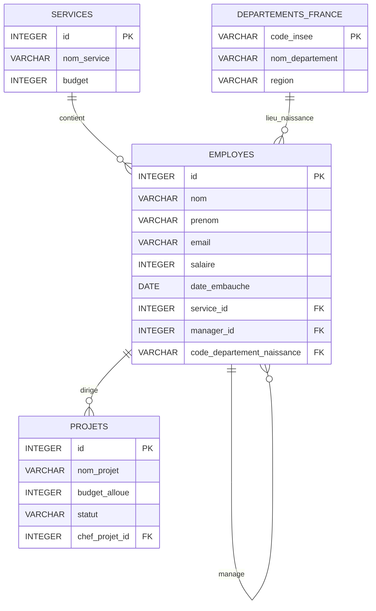

# TextToSQL — Agent IA de Langage Naturel vers SQL

> Transforme des questions en langage naturel en requêtes SQL validées, sécurisées et approuvées par l'utilisateur grâce à un pipeline multi-agents LangGraph.

---

## Présentation

**TextToSQL** est une application agentique qui prend une question utilisateur en langage naturel et génère, valide, puis exécute automatiquement la requête SQL correspondante sur une base de données SQLite.

Le pipeline est construit avec **LangGraph** et orchestre trois agents LLM spécialisés (analyseur de pertinence, générateur et validateur) connectés au sein d'un graphe à état, avec une logique de réessai automatique, une vérification syntaxique, une validation **Human-in-the-Loop** (interruption et confirmation par l'utilisateur avant toute exécution) et des sorties structurées.

---

## Fonctionnalités

- **Aiguillage de Pertinence** — Analyse la question avant toute génération pour classer la demande (`general_conversation`, `impossible_sql`, ou `feasible_sql`).
- **Agent Générateur** — Génère des requêtes SQL `SELECT` à partir de la question de l'utilisateur en langage naturel, en utilisant des outils pour inspecter le schéma et les valeurs réelles de la base.
- **Validation Syntaxique & AST (`sqlglot`)** — Analyse l'arbre syntaxique pour garantir qu'une seule instruction `SELECT` est soumise et valide son plan d'exécution via `EXPLAIN QUERY PLAN`.

- **Agent Validateur** — Un second agent qui vérifie la *logique métier* de la requête : jointures correctes, filtres appropriés, fidélité à l'intention de l'utilisateur.
- **Boucle d'Auto-Correction** — En cas d'erreur syntaxique ou de rejet par le validateur, la requête est régénérée automatiquement (jusqu'à 3 tentatives).
- **Validation Humaine (Human-in-the-Loop)** — Avant toute exécution en base de données, l'utilisateur est sollicité pour valider ou refuser l'exécution de la requête SQL générée.
- **Mode Chat (`--chat`)** — Support des conversations multi-tours avec mémoire contextuelle.
- **Garde de Sécurité** — Les instructions `DELETE`, `DROP`, `UPDATE` et `INSERT` sont bloquées avant toute exécution.
- **Sorties Structurées** — Les agents utilisent des modèles Pydantic pour garantir des réponses typées et validées par schéma.

---

## Schéma du Graphe



### 🛠 Tools des Agents

Tous les agents du pipeline (`agent_relevance_checker`, `agent_generator`, `agent_validator`) disposent d'un accès aux tools suivants pour interroger dynamiquement la base de données :

- **`get_distinct_values(table_name, column_name)`** : Inspecte les valeurs textuelles uniques d'une colonne donnée pour vérifier l'existence de valeurs métier et connaître la casse/orthographe exacte avant d'écrire ou de valider une clause `WHERE`.


---

## Installation

### 1. Cloner le dépôt

```bash
git clone https://github.com/your-username/TextToSQL.git
cd TextToSQL
```

### 2. Installer les dépendances

```bash
pip install -r requirements.txt
```

### 3. Configurer les variables d'environnement

Créez un fichier `.env` à la racine du projet :

```env
GOOGLE_API_KEY=votre_cle_api_google_ici
LANGSMITH_API_KEY=votre_cle_api_langsmith_ici
LANGSMITH_TRACING=true
LANGSMITH_PROJECT="TextToSQL"
```

> Obtenez une clé API gratuite sur [aistudio.google.com](https://aistudio.google.com/) et [smith.langchain.com](https://smith.langchain.com/).

## Modes d'Utilisation

### 1. Mode Interactif (Chat)
Pour échanger de manière continue avec l'agent tout en conservant l'historique de la session :

```bash
python main.py --chat
```

### 2. Requête Unique en Ligne de Commande
Pour exécuter une question spécifique directement :

```bash
python main.py "Qui sont les employés qui travaillent dans la tech ?"
```

### 3. Suite d'Exemples par Défaut
Pour lancer le script avec les requêtes de démonstration :

```bash
python main.py
```

---

## Exemples d'utilisation

### Exemple 1 : Requête SQL faisable
**Entrée :** `Qui sont les employés qui travaillent dans la tech ?`  
**Aiguillage :** `feasible_sql`  
**Requête SQL :**
```sql
SELECT e.nom, e.prenom
FROM employes e
JOIN services s ON e.service_id = s.id
WHERE s.nom_service = 'Tech & Data';
```
**Résultats :**
```text
+----------+----------+
| nom      | prenom   |
+----------+----------+
| Lovelace | Ada      |
| Turing   | Alan     |
| Hamilton | Margaret |
+----------+----------+
```

### Exemple 2 : Requête hors sujet
**Entrée :** `Salut ! comment ça va ?`  
**Aiguillage :** `general_conversation`  
**Statut :** `refused` (`Ceci n'est pas une requête SQL`)

### Exemple 3 : Donnée absente ou infaisable
**Entrée :** `Donne moi la liste des employés qui ont une voiture`  
**Aiguillage :** `impossible_sql`  
**Statut :** `refused` (`Il n'y a aucune information concernant les véhicules ou les voitures dans les tables de la base de données.`)

---

## Schéma de la Base de Données

