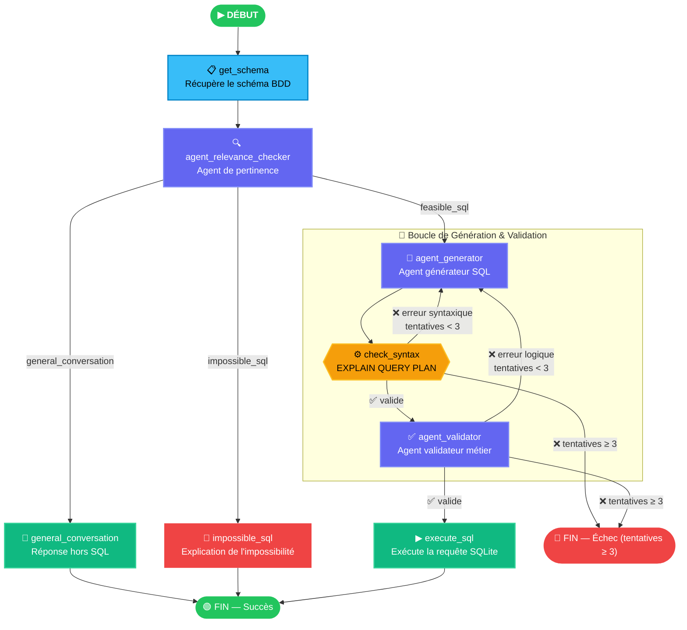
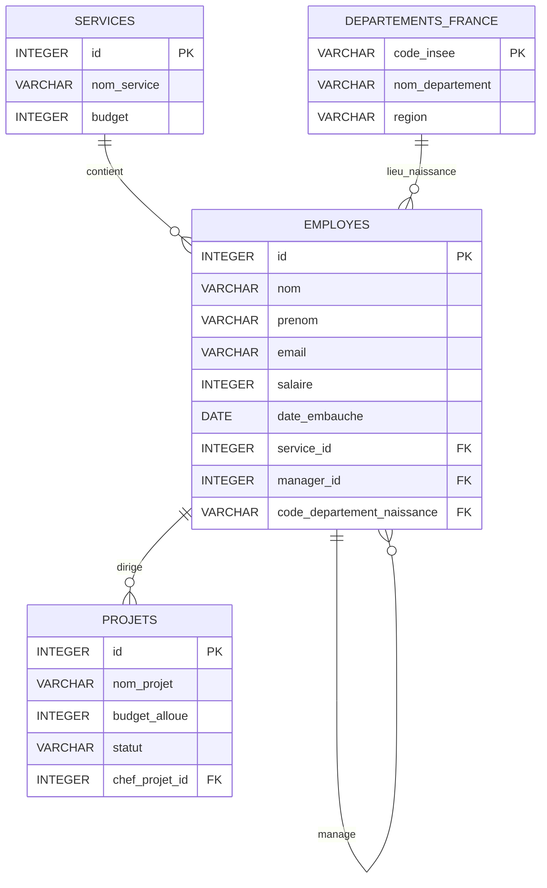

# TextToSQL — Agent IA de Langage Naturel vers SQL

> Transforme des questions en langage naturel en requêtes SQL validées et sécurisées grâce à un pipeline multi-agents LangGraph.

---

## Présentation

**TextToSQL** est une application agentique qui prend une question utilisateur en langage naturel et génère, valide, puis exécute automatiquement la requête SQL correspondante sur une base de données SQLite.

Le pipeline est construit avec **LangGraph** et orchestre trois agents LLM spécialisés (analyseur de pertinence, générateur et validateur) connectés au sein d'un graphe à état, avec une logique de réessai automatique, une vérification syntaxique et des sorties structurées.

---

## Fonctionnalités

- **Aiguillage de Pertinence** — Analyse la question avant toute génération pour classer la demande (`general_conversation`, `impossible_sql`, ou `feasible_sql`).
- **Agent Générateur** — Génère une requête SQL `SELECT` à partir d'une question en langage naturel, en utilisant des outils pour inspecter le schéma et les valeurs réelles de la base.
- **Vérification Syntaxique** — Valide la requête syntaxiquement via `EXPLAIN QUERY PLAN` de SQLite, avant toute évaluation par un agent.
- **Agent Validateur** — Un second agent LLM qui vérifie la *logique métier* de la requête : jointures correctes, filtres appropriés, fidélité à l'intention de l'utilisateur.
- **Boucle d'auto-correction** — Si la requête est syntaxiquement incorrecte ou logiquement erronée, le graphe la régénère automatiquement (jusqu'à 3 tentatives).
- **Garde de Sécurité** — Les instructions `DELETE`, `DROP`, `UPDATE` et `INSERT` sont bloquées avant toute exécution.
- **Sorties Structurées** — Les deux agents utilisent des modèles Pydantic pour garantir des réponses typées et validées par schéma.

---

## Schéma du Graphe



### 🛠 Tools des Agents

Tous les agents du pipeline (`agent_relevance_checker`, `agent_generator`, `agent_validator`) disposent d'un accès aux tools suivants pour interroger dynamiquement la base de données :

- **`get_distinct_values(table_name, column_name)`** : Inspecte les valeurs textuelles uniques d'une colonne donnée pour vérifier l'existence de valeurs métier et connaître la casse/orthographe exacte avant d'écrire ou de valider une clause `WHERE`.

---

## Stack Technique

| Bibliothèque | Utilisation |
|---|---|
| [LangGraph](https://github.com/langchain-ai/langgraph) | Orchestration du graphe multi-agents avec état |
| [LangChain](https://github.com/langchain-ai/langchain) | Création des agents, binding des outils, templates de prompts |
| [Google Gemini](https://ai.google.dev/) (`gemini-3.1-flash-lite`) | LLM pour les agents |
| [Pydantic](https://docs.pydantic.dev/) | Validation des sorties structurées |
| [SQLite](https://www.sqlite.org/) | Base de données relationnelle locale |

---

## Installation

### 1. Cloner le dépôt

```bash
git clone https://github.com/your-username/TextToSQL.git
cd TextToSQL
```

### 2. Installer les dépendances

```bash
pip install -r requirements.txt
```

### 3. Configurer la clé API

Créez un fichier `.env` à la racine du projet :

```env
GOOGLE_API_KEY=votre_clé_api_google_ici
LANGSMITH_API_KEY=votre_clé_api_langsmith_ici
LANGSMITH_TRACING=true
LANGSMITH_PROJECT="TextToSQL"
```

> Obtenez une clé API gratuite sur [aistudio.google.com](https://aistudio.google.com/) et [smith.langchain.com](https://smith.langchain.com/).

### 4. Lancer l'application

Vous pouvez poser une question directement en ligne de commande :

```bash
python main.py "REQUETE SQL"
```

exemple :

```bash
python main.py "Qui sont les employés qui travaillent dans la tech ?"
```

Ou exécuter la suite de requêtes d'exemples par défaut (sans argument) :

```bash
python main.py
```

---

## Exemples d'utilisation

### Exemple 1 : Requête SQL faisable
**Entrée :** `Qui sont les employés qui travaillent dans la tech ?`  
**Aiguillage :** `feasible_sql`  
**Résultat SQL :**
```sql
SELECT e.nom, e.prenom
FROM employes e
JOIN services s ON e.service_id = s.id
WHERE s.nom_service = 'Tech & Data';
```
**Résultats :** `[('Lovelace', 'Ada'), ('Turing', 'Alan'), ('Hamilton', 'Margaret')]`

### Exemple 2 : Requête hors sujet
**Entrée :** `Salut ! comment ça va ?`  
**Aiguillage :** `general_conversation`  
**Résultats :** `Ceci n'est pas une requête SQL`

### Exemple 3 : Donnée absente ou infaisable
**Entrée :** `Donne moi la liste des employés qui ont une voiture`  
**Aiguillage :** `impossible_sql`  
**Résultats :** `Il n'y a aucune information concernant les véhicules ou les voitures dans les tables de la base de données.`

---

## Schéma de la Base de Données

